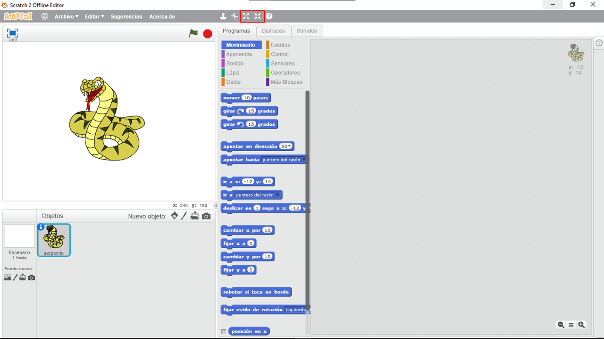

# Notas: 

> Para poder usar los archivos .svg selecciona la opción **"Cargar objeto desde archivo"** (marcado con el recuadro rojo)

***

> Una vez seleccionado el archivo podemos cambiarle el tamaño con las opciones **"Crecer"** y **"Encoger"** (marcados con el recuadro rojo)

***

